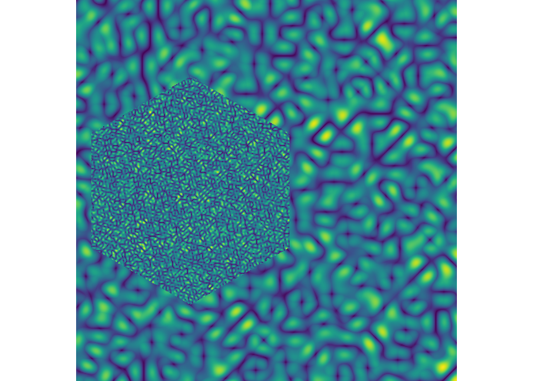

<!-- README.md is generated from README.Rmd. Please edit that file -->

# scopes

<!-- badges: start -->

<!-- badges: end -->

The goal of scopes is to …

## Installation

You can install the released version of scopes from
[CRAN](https://CRAN.R-project.org) with:

``` r
install.packages("scopes")
```

And the development version from [GitHub](https://github.com/) with:

``` r
# install.packages("devtools")
devtools::install_github("djnavarro/scopes")
```

## Example

This is a basic example which shows you how to solve a common problem:

``` r
library(scopes)

dat <- scope_grid(inner = scope_texture(frequency = 10))
dat
#> # A tibble: 4,000,000 x 7
#>        x        y inside   outer   inner index color    
#>    <dbl>    <dbl> <lgl>    <dbl>   <dbl> <dbl> <chr>    
#>  1     0 0        FALSE  1.33e23 1.33e23   372 #423F85FF
#>  2     0 0.000500 FALSE  1.33e23 1.33e23   372 #423F85FF
#>  3     0 0.00100  FALSE  1.33e23 1.33e23   372 #423F85FF
#>  4     0 0.00150  FALSE  1.33e23 1.33e23   372 #423F85FF
#>  5     0 0.00200  FALSE  1.33e23 1.33e23   372 #423F85FF
#>  6     0 0.00250  FALSE  1.33e23 1.33e23   372 #423F85FF
#>  7     0 0.00300  FALSE  1.33e23 1.33e23   372 #423F85FF
#>  8     0 0.00350  FALSE  1.33e23 1.33e23   372 #423F85FF
#>  9     0 0.00400  FALSE  1.33e23 1.33e23   372 #423F85FF
#> 10     0 0.00450  FALSE  1.33e23 1.33e23   372 #423F85FF
#> # … with 3,999,990 more rows

scope_plot(dat)
```


